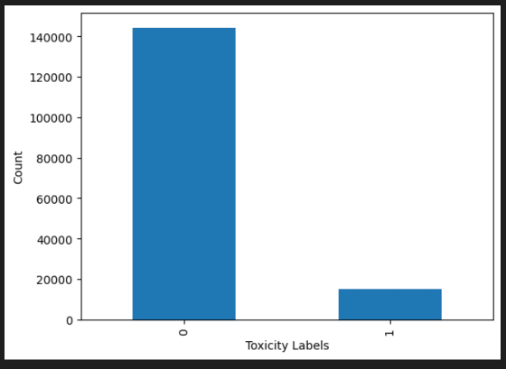
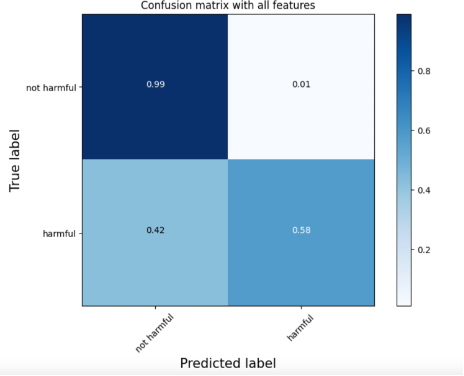
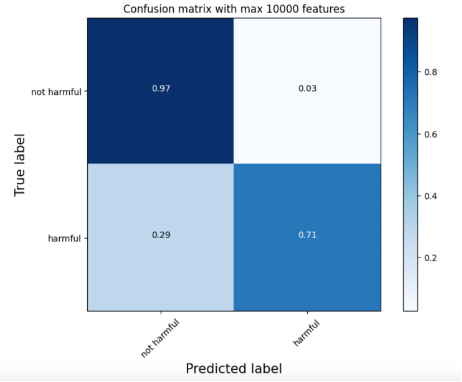
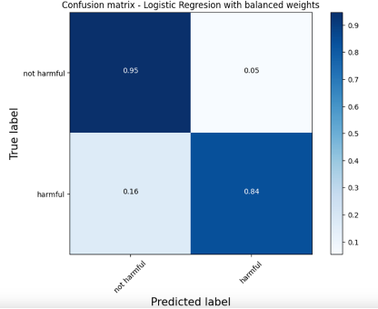
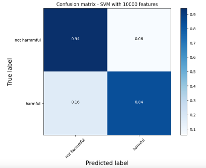
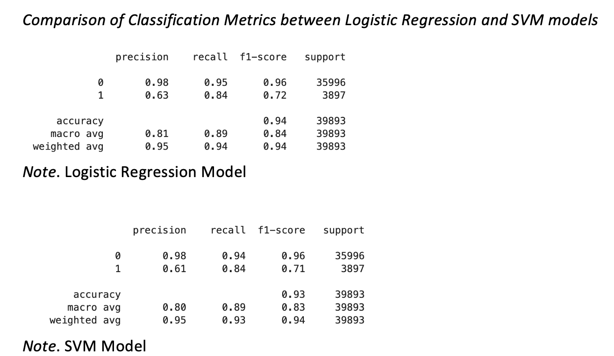
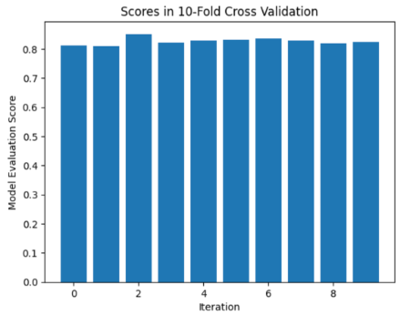

# Harmful Comment Detection in Social Media Posts

Social media use presents the risks of exposure to harmful contents that can adversely impact mental health by increasing FOMO (fear or missing out), depression, bullying, and anxiety.  As per Yale Medicine (2024), “In the spring of 2023, United States Surgeon General Vivek Murthy, MD, MBA, released an advisory called Social Media and Youth Mental Health, in which he says there is growing evidence that social media is causing harm to young people’s mental health”. 
Irrespective of the risks of social media, the benefits must not be undermined. Social media acts a platform to foster healthy connections among people particularly for shy teens and young adults. It provides a platform for them to discover and connect with other people with similar nature and share their feelings which enables well-being and happiness. Furthermore, social media also allows staying connected with friends and family that stay far away when in-person connection is not possible. Having said that, social media is to stay and so it calls for shared responsibility from both the users and the hosting companies. Social media companies can utilize AI and ML to automatically detect harmful content and filter such content so that those are not displayed to teens and young adults.

This study will focus on how Machine Learning can be used to detect harmful comments and posts utilizing Natural Language Processing. The goal is to identify comment and posts with harmful content so such items can be filtered an only non-harmful items are visible to teens in the social media posts.

### Datasets

The dataset identified for this study is taken from Kaggle which was made available as part of “Jigsaw Unintended Bias in Toxicity Classification” competition (Kaggle, 2019). The dataset consists of approximately 2M public comments and toxicity levels of such comments. The dataset was originally released by Civil comments which is a plugin for independent news sites. The comments were created out of public comments that appeared across 50 English news sites from 2015 to 2017. The toxicity level is a binary value of 0 or 1, where 0 stands for “not toxic” and 1 stands for “toxic”. 

### Approach

The text classification approach will consist of three main steps: transforming raw text into feature vectors using tokenization; training multiple classifiers such as Naïve Bayes, Support Vector Machine, and Logistic Regression using the feature vectors; finally evaluate performance of multiple models to choose the best performing model. The best model can then be deployed in real world applications to perform the required task. In any natural language processing task, the raw text needs preprocessing before it can be used in building ML models. Standardization, Lemmatization and Vectorization will be performed to preprocess the text comments. TF-IDF vectorization techniques is used to perform vectorization of the text comments. 

### Results

Quick exploratory data analysis showed that there is no problem of missing data in the dataset. However, an imbalance between the number of positive class (harmful comments) instances and negative class (non-harmful comments) instances have been identified. Such imbalances may skew the model and adversely impact performance of the positive class identification. The class imbalances were handled by the usage of weight parameter in the classifiers during training.

Recall, Precision and ROC-AUC metrics are used to evaluate the performance of models. Recall measures a model’s ability to identify an observation of positive class. Model will high recall is able to identify larger number of positive class instances which is important in this study as the nature of the problem is to identify as many possible occurrences as possible of harmful comments. Precision shows a model’s ability to truly identify a positive class. In this use case, Recall is more important than Precision because the harm of not identifying harmful comment is much more than mis-identifying a harmful comment. It is better to identify as many probable harmful comments even if some of them may not be truly harmful. Area under ROC curve is used to evaluate the quality of binary classifiers (having only two classes). In addition to recall, AUC-ROC was used to evaluate the quality of models.

As a starting, a simple Naïve Bayes classifier was fitted using all the 176910 features. The classifier performed well for the negative class (non-harmful comment), but it performed poorly for the positive (harmful comment) class. It only able to accurately identify 58% of harmful comments while making error for rest of 42%

The feature extraction was restricted to only 10000 features and the same Naïve bayes classifier was trained again with these 10000 features. The model with 10000 features was able to accurately identify 71% of harmful comment and error of misclassifying reduced to 29%. This is substantial increase in performance achieved by just reducing the number of features. 

Logistic Regression and Support Vector Machines (SVM) models were further trained with class_weight set to “balanced” and using 10000 features. 

Both the Logistic Regression and SVM model performed well with accurately identifying 84% of the harmful comments which is a good performance lift (13%) compared to Naïve Bayes model.

Even though both Logistic Regression and SVM have similar confusion matrix; precision and F1-score of Logistic Regression model is slightly better than the SVM. 

A 10-fold cross validation of the Logistic Regression model demonstrated that the score does not vary among the iterations of the cross validation. Hence, the model does not suffer much from “overfitting” and will generalize well with unseen data.

### References

Kaggle. (2019.). _Jigsaw Unintended Bias in Toxicity Classification._ Retrieved December 24, 2024, from **https://www.kaggle.com/c/jigsaw-unintended-bias-in-toxicity-classification/data**

Katella, Kathy. (2024, June 17). _How Social Media Affects Your Teen’s Mental Health: A Parent’s Guide._
Yale Medicine.  **https://www.yalemedicine.org/news/social-media-teen-mental-health-a-parents-guide**

Vajjala, S., Maumder, B., Gupta, & A. Surana, H. (June 2020). Practical Natural Language Processing. 
O’Reilly Media Inc.
